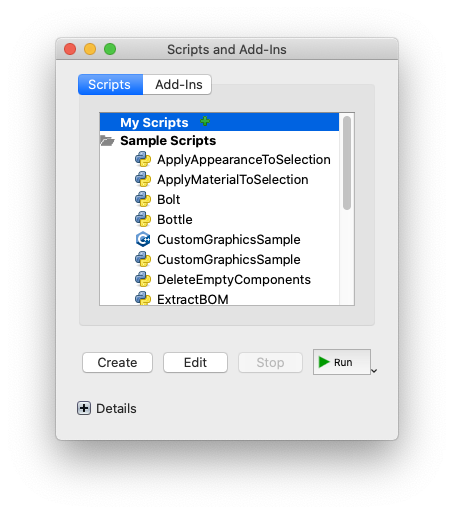
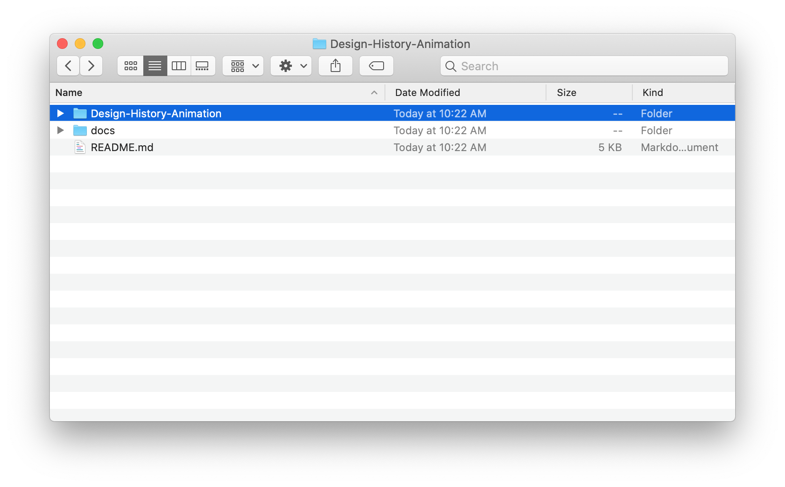

# Fusion360 Scripts

This repo contains a number of Fusion360 scripts.  More info about each script is given in the README.md inside each folder.

## [Design Version Timelapse](Design-Version-Timelapse/)

Turn your Fusion360 design versions (i.e. all your previous saves) into a timelapse animation.


## [Design History Animation](Design-History-Animation/)

Turn your Fusion360 design history timeline into an animation.


## [Spin Animation](Spin-Animation/)

Spin your design and export screenshots.


## Installation

Download this repository as ZIP and unzip the folder (put this folder in a place where you won't delete it later):


In the *Design* workspace, go to the *Tools* tab and select *Add Ins > Scripts and Add-Ins...*:


Click the green plus sign next to My Scripts:



Then Select the folder called e.g. `Design-History-Animation` inside `Fusion360-Scripts/Design-History-Animation`:



You should now see it added to your scripts.  To Run the script, select it and press *Run*:


## Creating an Animation Video

After all the still frames (with the name FILENAME_###.png) are generated, I use [ffmpeg](https://ffmpeg.org/) to compile the stills into an animation.  From the terminal run:

```ffmpeg -r 30 -i PATH_TO_FRAMES/FILENAME_%d.png -c:v libx264 -preset slow -crf 22 -pix_fmt yuv420p -an OUTPUT_DIRECTORY/animation.mp4```

`-r 30` sets the framerate to 60 fps  
`-c:v libx264 -preset slow -crf 22` encodes as h.264 with better compression settings  
`-pix_fmt yuv420p` makes it compatible with the web browser  
`-an` creates a video with no audio  
You can optionally specify `-s 640x640` to control the output size of the video  
If your filename has spaces in it, you can escape them with `-i PATH_TO_FRAMES/filename\ with\ spaces_%d.png`  


## Creating an Animated GIF

I upload the resulting video or raw frames to [ezgif](https://ezgif.com/) to create an animated gif.  I'm sure many other solutions exist (e.g. Photoshop, Premiere, GIMP, ffmpeg).
